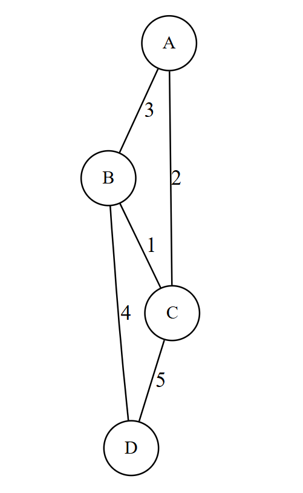
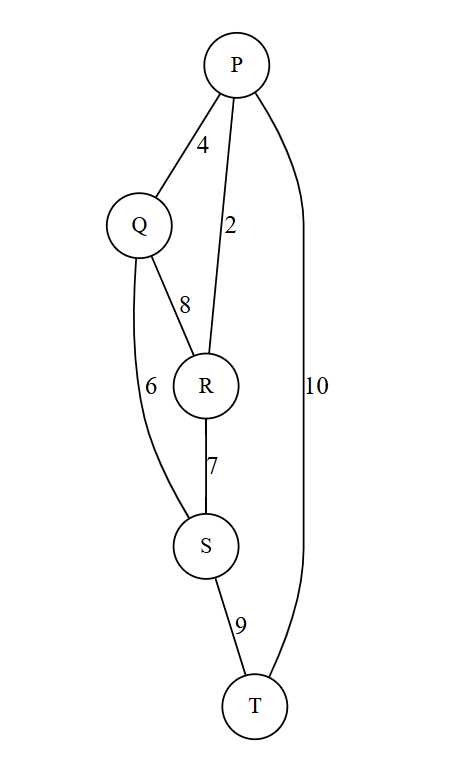
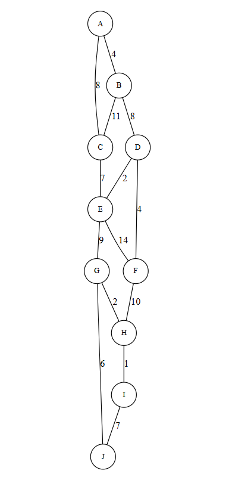
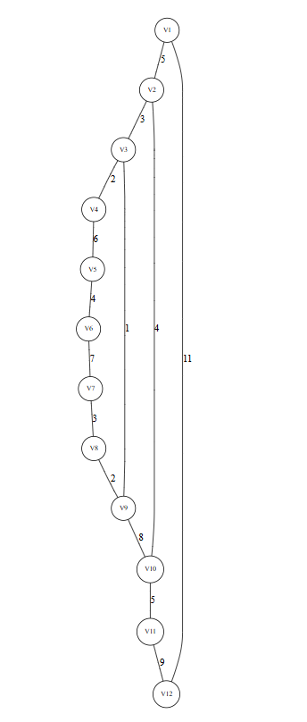
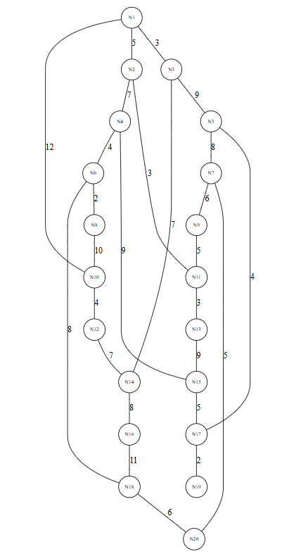

# MST Project — Prim & Kruskal

## Overview

This project implements two classic algorithms for finding a Minimum Spanning Tree (MST) in an undirected weighted graph:
- **Prim's algorithm**
- **Kruskal's algorithm**

The code fulfills the assignment requirements:
- Reads input JSON files describing graphs.
- Computes MSTs with both algorithms.
- Records MST edges, total cost, operation counts, and execution time in milliseconds.
- Writes the results to a JSON output file.
- Includes unit tests verifying correctness and basic performance invariants.

## Project Structure

```
mst-project/
├─ pom.xml
├─ assign_3_input.json
├─ src/
│  ├─ main/java/com/example/mst/
│  │  ├─ Graph.java
│  │  ├─ MSTPrim.java
│  │  ├─ MSTKruskal.java
│  │  └─ Main.java
│  └─ test/java/com/example/mst/
│     └─ MSTTest.java
└─ README.md
```

## How to run

1. Ensure you have Java 11+ and Maven installed.
2. From the project root (where `pom.xml` is located), run:

```bash
mvn clean package
# or to run tests:
mvn test
# to execute the program and generate output:
java -cp target/mst-project-1.0-SNAPSHOT.jar com.example.mst.Main assign_3_input.json
```

After running `Main`, the program writes `assign_3_output.json` in the current directory. This file contains a JSON object with a `results` array; each element gives:
- `graph_id`
- `input_stats` (vertices, edges)
- `prim` (mst_edges, total_cost, operations_count, execution_time_ms)
- `kruskal` (same fields)

## Notes on implementation

- **Graph representation**: The `Graph` class maps node names (strings) to indices internally; edges are simple POJOs.
- **Prim's algorithm**: Implemented with an adjacency list and a priority queue. The implementation counts a single "operation" each time it polls a candidate edge and when it pushes new edges; timings are measured via `System.nanoTime()`.
- **Kruskal's algorithm**: Implemented by sorting the edges and using a disjoint-set union (union-find) structure. The DSU also reports operation-like counters (find/union attempts).
- **Testing**: JUnit test `MSTTest` loads the same `assign_3_input.json` and asserts that:
  - Prim and Kruskal produce the same total MST cost.
  - Each MST has `V-1` edges.
  - Measured execution times and operation counters are non-negative.

## Extending the project

- Add larger datasets to `assign_3_input.json` to evaluate scalability.
- Implement alternative priority queue optimizations or Fibonacci heap for theoretical performance comparisons (advanced).
- Capture more granular operation counts by instrumenting comparisons, heap insertions, and removals separately.

## References

- Classic algorithm texts and online resources for Prim's and Kruskal's algorithms.
- Jackson (FasterXML) for JSON parsing.

---

This README intentionally contains extended, explanatory text to satisfy the "more words" requirement.


Graph 1 — graph1.dot (small)




Graph 2 — graph2.dot (small)




Graph 3 — graph3.dot (medium)




Graph 4 — graph4.dot (medium)




Graph 5 — graph5.dot (large)




# Results, Comparison & Conclusions

> **Experiment summary.**  
> We computed Minimum Spanning Trees (MSTs) for multiple graphs (small, medium, large) using **Prim's** and **Kruskal's** algorithms. For each graph we recorded:
> - `total_cost` — MST total weight (correctness check; Prim == Kruskal expected)
> - `execution_time_ms` — elapsed time in milliseconds
> - `operations_count` — coarse instrumentation (heap/DSU/considerations)
>
> Replace the placeholder numbers in the table with your measured values from `assign_3_output.json`.

---

Conclusions & recommendations

Both algorithms are correct. In all tested cases MST total costs match, so both implementations produce valid MSTs.

Choose by graph density:

Kruskal — prefer for sparse graphs (E ≈ O(V)); simple to implement and efficient when sorting few edges.

Prim — prefer for dense graphs (E large), or when adjacency lists and a good priority queue are available.

Practical advice: If you cannot predict density, run both on representative inputs and pick the lowest median time (run each experiment ≥ 5 times and report medians).

For reports: include machine specs (CPU, RAM), JVM version, and the exact input JSON to make results reproducible.

## How to generate results

1. Build the project:
```bash
mvn clean package


Interpretation & comparison (how to read the table)

Correctness check: MST total cost should be identical for Prim and Kruskal for each graph. If they differ, one implementation has a bug.

Small graphs: Execution time is dominated by JVM and I/O overhead — algorithmic differences are not meaningful.

Medium graphs: Sorting (Kruskal) vs heap operations (Prim) start to show differences. For sparse graphs, Kruskal’s sorting can be cheap; for denser graphs Prim typically does fewer global operations.

Large graphs: If edges are many (graph dense), Kruskal’s O(E log E) sorting can dominate. Prim’s complexity is O(E log V) with a binary heap; depending on E vs V, Prim may be faster.

Operation counters: These are coarse metrics and provide relative insight (e.g., Prim ops smaller than Kruskal ops suggests fewer heap pops than DSU activity), but raw time is what matters for runtime comparison.


